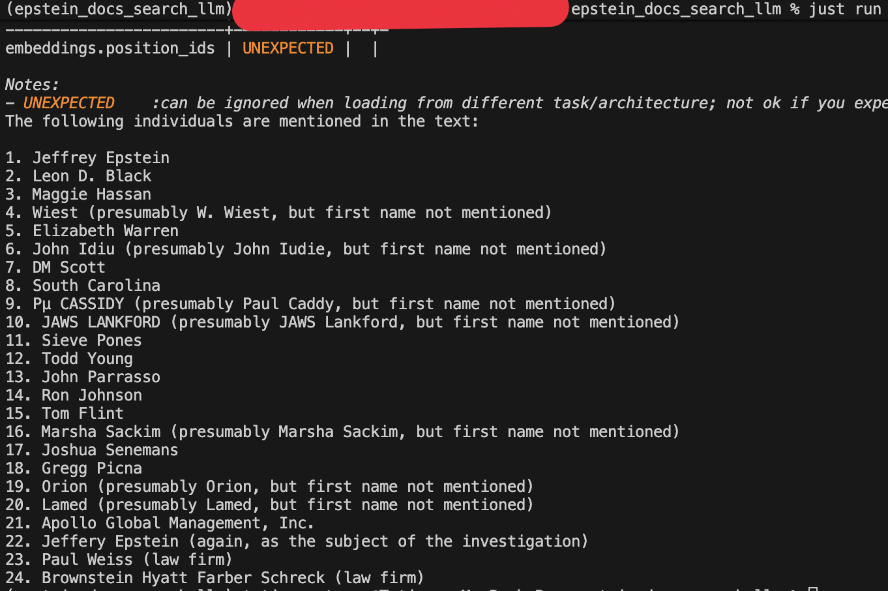

# Epstein's documents search

This is leisure project to search pdf files for specific information using LLMs and data from
USA [government](https://www.justice.gov/epstein/doj-disclosures/data-set-12-files)

# Requirements

- Just
- Python
- Ollama

# Setup

To start, use:
```python
just install
source .venv/bin/activate
ollama pull llama3.2:1b  # A lightweight model that runs fast on any laptop
```

# How it works?

The `app/main.py` script implements a RAG (Retrieval-Augmented Generation) pipeline:

1. **Ingestion**: Loads the PDF and splits it into text chunks using `RecursiveCharacterTextSplitter`.
2. **Embedding**: Converts chunks into vectors using `HuggingFaceEmbeddings` and stores them in a local `Chroma` database.
3. **Retrieval**: Queries the database for the top 3 chunks most similar to the user's question.
4. **Generation**: Feeds the retrieved context and question into the `llama3.2:1b` model (via Ollama) to generate an answer.

Result sample:


## License

MIT License